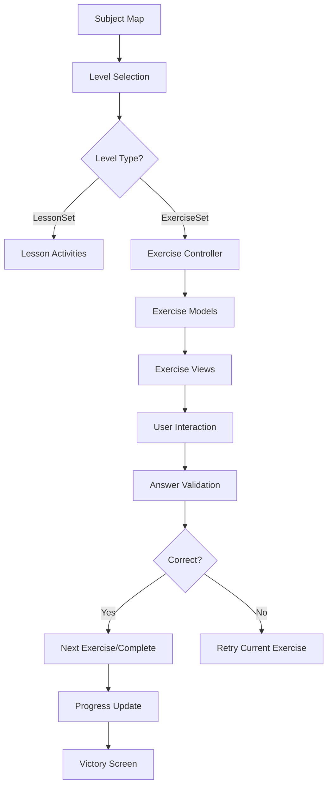

# Le Petit Davinci - Architecture Documentation

## 📋 Table of Contents
1. [Overview](#overview)
2. [Project Structure](#project-structure)
3. [Core Architecture](#core-architecture)
4. [Features Architecture](#features-architecture)
5. [Exercises System](#exercises-system)
6. [Lessons System](#lessons-system)
7. [Subject-Specific Implementation](#subject-specific-implementation)
8. [Data Flow](#data-flow)
9. [State Management](#state-management)
10. [Adding New Features](#adding-new-features)

---

## 🎯 Overview

Le Petit Davinci is a Flutter-based educational app that follows a **modular, feature-based architecture** with clear separation between reusable components (exercises, lessons) and subject-specific content (English, Math, French).

### Key Principles
- **Separation of Concerns**: Exercise system is subject-agnostic
- **Reusability**: Same infrastructure across all subjects
- **Scalability**: Easy to add new subjects and activity types
- **Maintainability**: Consistent patterns throughout the codebase

---

## 📁 Project Structure

```
lib/
├── app.dart                    # Main app configuration
├── main.dart                   # App entry point
├── core/                       # Shared utilities and constants
│   ├── constants/             # Colors, sizes, assets, etc.
│   ├── utils/                 # Device utils, color utils, etc.
│   └── widgets/               # Reusable UI components
├── data/                      # Data models and services
│   ├── models/                # Core data models
│   └── services/              # Progress tracking, level utils
├── features/                  # Feature-based modules
│   ├── exercises/             # Reusable exercise system
│   ├── lessons/               # Reusable lesson system
│   ├── english/               # English subject implementation
│   ├── math/                  # Math subject implementation
│   ├── french/                # French subject implementation
│   └── home/                  # Home screen and navigation
├── mixin/                     # Shared mixins (e.g., Audible)
├── routes/                    # App routing configuration
└── services/                  # Global services
```

---

## 🏗️ Core Architecture

### Base Classes

#### Exercise System
```dart
// Abstract base class for all exercises
abstract class Exercise {
  Widget build(BuildContext context);
  bool get isAnswerReady;
  Stream<bool> get isAnswerReadyStream;
  AnswerResult checkAnswer();
  void reset();
}
```

#### Lesson System
```dart
// Abstract base class for all lesson activities
abstract class Activity {
  final RxBool isCompleted = false.obs;
  Widget build(BuildContext context);
  void dispose() {}
}
```

#### Content Organization
```dart
// Base class for level content
abstract class LevelContent {}

// Wrapper for lesson-based levels
class LessonSet extends LevelContent {
  final Lesson lesson;
}

// Wrapper for exercise-based levels
class ExerciseSet extends LevelContent {
  final List<Exercise> exercises;
}
```

---

## 🎮 Features Architecture

### Subject Structure Pattern

Each subject (English, Math, French) follows the **identical structure**:

```
features/[subject]/
├── [subject]_levels.dart      # Configuration & sections
├── data/
│   └── level_content.dart     # Content map (unified[Subject]Levels)
├── views/
│   └── [subject]_map.dart     # Map interface
└── controllers/
    └── [subject]_map_controller.dart
```

### Configuration Pattern

All subjects use the same configuration structure:

```dart
// Constants
const String [SUBJECT]_LANG_CODE = '[code]';
const String [SUBJECT]_DIALECT = '[dialect]';

// Level configurations
final List<LevelConfig> [subject]Levels = LevelUtils.generateLevelConfigsFromData(
  unified[Subject]Levels,
);

// Section data
List<SectionData> get [subject]MapSections => [
  SectionData(
    color: AppColors.[color],
    level: 1,
    section: 1,
    title: '[Section Title]',
    levels: generate[Subject]LevelModels(start, end),
  ),
];
```

---

## 🧩 Exercises System

### Directory Structure
```
features/exercises/
├── models/                    # Exercise model definitions
│   ├── exercise_model.dart    # Base Exercise class
│   ├── answer_result_model.dart
│   ├── fill_the_blank_exercise_model.dart
│   ├── listen_and_choose_exercise_model.dart
│   ├── reorder_words_exercise_model.dart
│   ├── solve_equation_exercise_model.dart
│   ├── count_by_exercise_model.dart
│   ├── story_problem_exercise.dart
│   ├── math_crossword_exercise_model.dart
│   └── [other exercise models]
├── views/                     # Exercise view implementations
│   ├── exercise.dart          # Main exercise screen
│   ├── fill_the_blank_view.dart
│   ├── listen_and_choose_view.dart
│   └── [other exercise views]
├── controllers/               # Exercise flow management
│   ├── exercises_controller.dart
│   └── victory_controller.dart
└── widgets/                   # Reusable exercise components
    ├── choice_button.dart
    ├── numpad.dart
    ├── play_audio_button.dart
    └── stars_section.dart
```

### Exercise Types

#### Language Exercises
- **FillTheBlankExercise**: Multiple choice questions
- **ListenAndChooseExercise**: Audio-based image selection
- **ReorderWordsExercise**: Word ordering challenges
- **StoryExercise**: Interactive story-based learning

#### Math Exercises
- **SolveEquationExercise**: Basic arithmetic
- **CountByExercise**: Skip counting patterns
- **FollowPatternExercise**: Pattern recognition
- **StoryProblemExercise**: Word problems with drag-and-drop
- **MathEquationCrosswordExercise**: Math crossword puzzles

### Exercise Controller Flow

```dart
class ExercisesController extends GetxController {
  // Core Properties
  final List<Exercise> exercises;
  final String dialect;
  final int levelNumber;
  final String language;
  final Subjects subject;

  // Flow Management
  void checkAnswer() {
    final result = currentExercise.checkAnswer();
    // Show feedback, handle next step
  }

  void _handleNextStep(bool isCorrect) {
    if (isCorrect) {
      // Move to next exercise or complete level
    } else {
      // Reset current exercise for retry
    }
  }
}
```

---

## 📚 Lessons System

### Directory Structure
```
features/lessons/
├── models/                    # Activity model definitions
│   ├── activity_model.dart    # Base Activity class
│   ├── video_activity_model.dart
│   ├── drawing_activity_model.dart
│   ├── audio_matching_activity_model.dart
│   └── multiple_choice_activity_model.dart
├── views/                     # Activity view implementations
│   ├── video_activity_view.dart
│   ├── drawing_activity_view.dart
│   └── audio_matching_activity_view.dart
└── widgets/                   # Lesson-specific components
    └── full_screen_video_player.dart
```

### Activity Types

#### Core Activities
- **VideoActivity**: YouTube video integration with mascot intro
- **DrawingActivity**: Drawing canvas with templates
- **AudioMatchingActivity**: Audio-word matching exercises
- **MultipleChoiceActivity**: Multiple choice questions

### Activity Flow

```dart
class Activity {
  final RxBool isCompleted = false.obs;
  
  Widget build(BuildContext context);
  void dispose() {}
}

class Lesson {
  final String lessonId;
  final String title;
  final String introduction;
  final List<Activity> activities;
}
```

---

## 🎯 Subject-Specific Implementation

### English Section

#### Content Organization
- **"The Alphabets"** (Levels 1-21): A-Z learning in groups of 4 letters
- **"The Animals"** (Levels 22-30): Farm and wild animals

#### Content Structure
```dart
final Map<int, LevelContent> unifiedEnglishLevels = {
  1: LessonSet(Lesson(...)),           // Interactive lesson
  2: ExerciseSet([                     // Exercise collection
    FillTheBlankExercise(...),
    ListenAndChooseExercise(...),
  ]),
  // ... more levels
};
```

### Math Section

#### Content Organization
- **"Numbers"** (Levels 1-10): Basic arithmetic and counting
- **"Shapes"** (Levels 11-20): Geometry and patterns

#### Content Structure
```dart
final Map<int, LevelContent> unifiedMathLevels = {
  1: ExerciseSet([
    SolveEquationExercise(...),
  ]),
  2: ExerciseSet([
    CountByExercise(...),
    FollowPatternExercise(...),
  ]),
  // ... more levels
};
```

---

## 🔄 Data Flow

### Level Progression Flow



### Content Generation Flow

```dart
// 1. Define content map
final Map<int, LevelContent> unified[Subject]Levels = {...};

// 2. Generate level configs
final List<LevelConfig> [subject]Levels = LevelUtils.generateLevelConfigsFromData(
  unified[Subject]Levels,
);

// 3. Generate level models for sections
List<Level> generate[Subject]LevelModels(int start, int end) {
  return LevelUtils.generateLevelModels(
    levelConfigs: [subject]Levels,
    contentMap: unified[Subject]Levels,
    start: start,
    end: end,
    language: [SUBJECT]_LANG_CODE,
    dialect: [SUBJECT]_DIALECT,
  );
}

// 4. Create section data
List<SectionData> get [subject]MapSections => [...];
```

---

## 🎛️ State Management

### GetX Integration

The app uses **GetX** for state management with the following patterns:

#### Controllers
```dart
class [Subject]MapController extends GetxController {
  final RxList<SectionData> mapSections = <SectionData>[].obs;
  
  void loadMapData() {
    mapSections.assignAll([subject]MapSections);
  }
}
```

#### Reactive State
```dart
// Exercise state
final Rxn<int> selectedIndex = Rxn<int>();
final RxBool isAnswerReady = false.obs;

// Activity state
final RxBool isCompleted = false.obs;
```

#### Navigation
```dart
// Route to exercise
Get.to(() => ExerciseScreen(), binding: ExercisesBinding());

// Route to lesson
Get.to(() => LessonScreen(), binding: LessonBinding());
```

---

## 🚀 Adding New Features

### Adding a New Subject

1. **Create subject directory structure**:
   ```
   features/[new_subject]/
   ├── [new_subject]_levels.dart
   ├── data/level_content.dart
   ├── views/[new_subject]_map.dart
   └── controllers/[new_subject]_map_controller.dart
   ```

2. **Define content map**:
   ```dart
   final Map<int, LevelContent> unified[NewSubject]Levels = {
     // Define levels with LessonSet or ExerciseSet
   };
   ```

3. **Create configuration**:
   ```dart
   const String [NEW_SUBJECT]_LANG_CODE = '[code]';
   const String [NEW_SUBJECT]_DIALECT = '[dialect]';
   ```

4. **Add to routing and navigation**

### Adding a New Exercise Type

1. **Create exercise model**:
   ```dart
   class NewExercise extends Exercise {
     // Implement required methods
     @override
     Widget build(BuildContext context) => NewExerciseView(exercise: this);
     
     @override
     bool get isAnswerReady => /* logic */;
     
     @override
     AnswerResult checkAnswer() => /* logic */;
     
     @override
     void reset() => /* logic */;
   }
   ```

2. **Create exercise view**:
   ```dart
   class NewExerciseView extends StatelessWidget {
     final NewExercise exercise;
     // Implement UI
   }
   ```

3. **Add to content maps**:
   ```dart
   ExerciseSet([
     NewExercise(...),
   ])
   ```

### Adding a New Activity Type

1. **Create activity model**:
   ```dart
   class NewActivity extends Activity {
     @override
     Widget build(BuildContext context) => NewActivityView(activity: this);
   }
   ```

2. **Create activity view**:
   ```dart
   class NewActivityView extends StatelessWidget {
     final NewActivity activity;
     // Implement UI
   }
   ```

3. **Add to lesson content**:
   ```dart
   Lesson(
     activities: [
       NewActivity(...),
     ],
   )
   ```

---

## 📝 Key Files Reference

### Core Files
- `lib/features/exercises/models/exercise_model.dart` - Base exercise class
- `lib/features/lessons/models/activity_model.dart` - Base activity class
- `lib/data/models/subject/level_content.dart` - Content organization
- `lib/services/level_utils.dart` - Level generation utilities

### Subject Files
- `lib/features/english/english_levels.dart` - English configuration
- `lib/features/english/data/level_content.dart` - English content
- `lib/features/math/math_levels.dart` - Math configuration
- `lib/features/math/data/math_levels.dart` - Math content

### Controllers
- `lib/features/exercises/controllers/exercises_controller.dart` - Exercise flow
- `lib/features/english/controllers/english_map_controller.dart` - English map
- `lib/features/math/controllers/math_map_controller.dart` - Math map

---

## 🎨 Design Patterns Used

1. **Abstract Factory**: Exercise and Activity base classes
2. **Strategy Pattern**: Different exercise types with same interface
3. **Observer Pattern**: GetX reactive state management
4. **Template Method**: Common flow in controllers
5. **Dependency Injection**: GetX bindings and lazy loading

---

## 🔧 Development Guidelines

### Code Organization
- Keep subject-specific code in respective feature directories
- Reusable components go in `core/widgets/`
- Shared models go in `data/models/`
- Services go in `services/`

### Naming Conventions
- Controllers: `[Feature]Controller`
- Models: `[Feature]Model` or `[Feature]Exercise`
- Views: `[Feature]View` or `[Feature]Screen`
- Files: `snake_case.dart`

### State Management
- Use GetX observables for reactive state
- Keep state local to components when possible
- Use controllers for complex state management

---

This documentation should serve as a comprehensive reference for understanding and extending the Le Petit Davinci architecture. The modular design makes it easy to add new subjects, exercises, and activities while maintaining consistency across the entire application.
